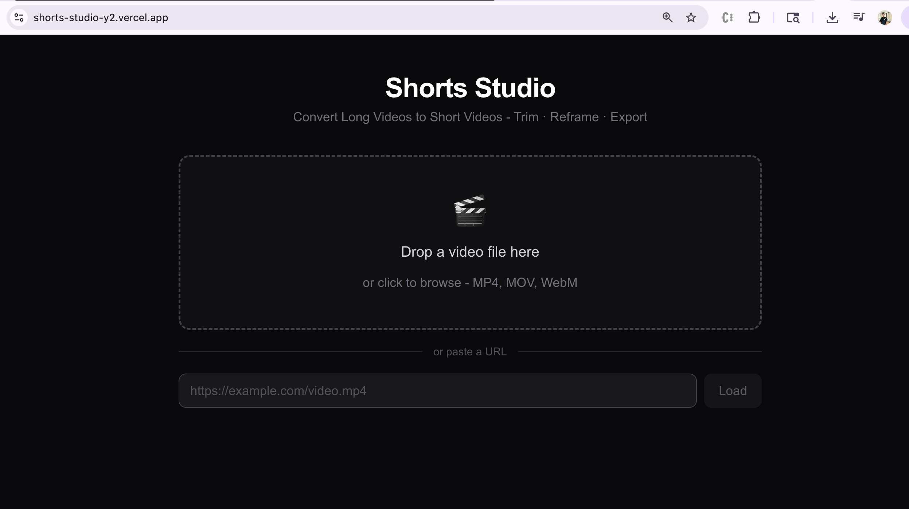
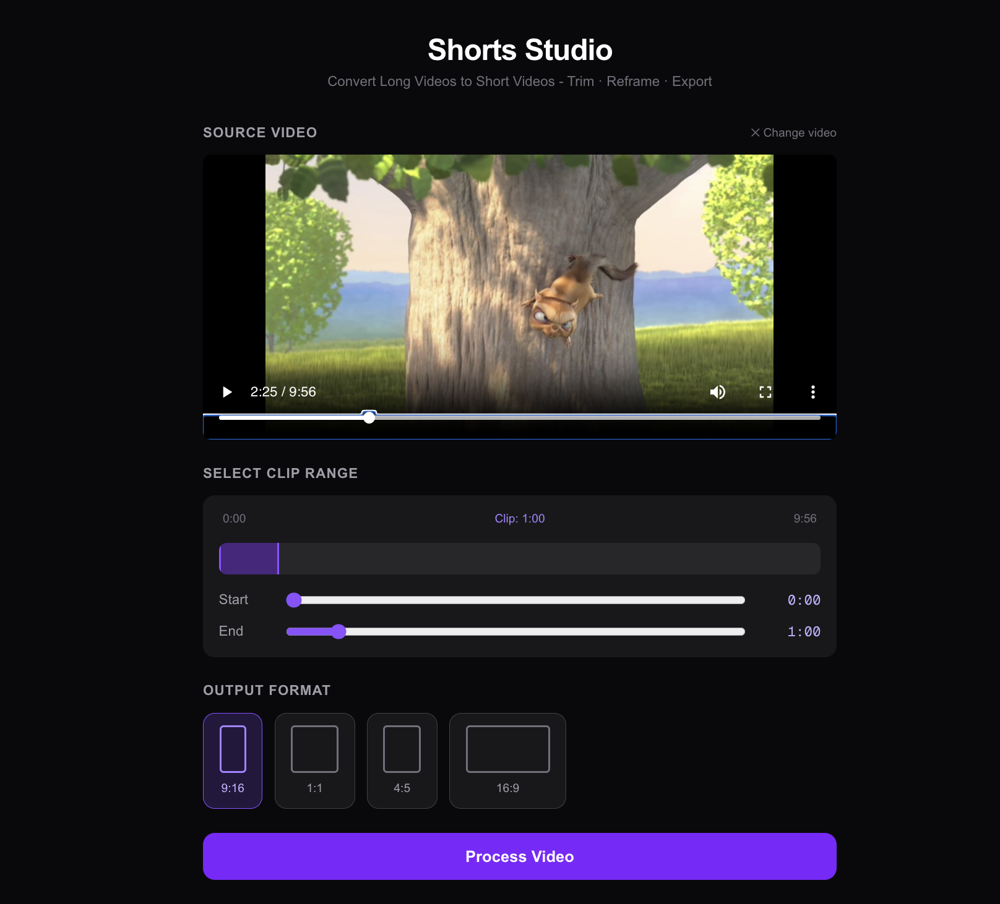
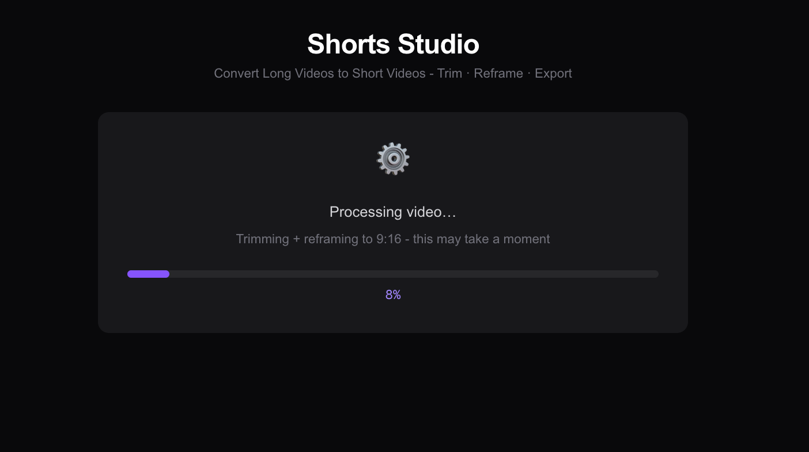
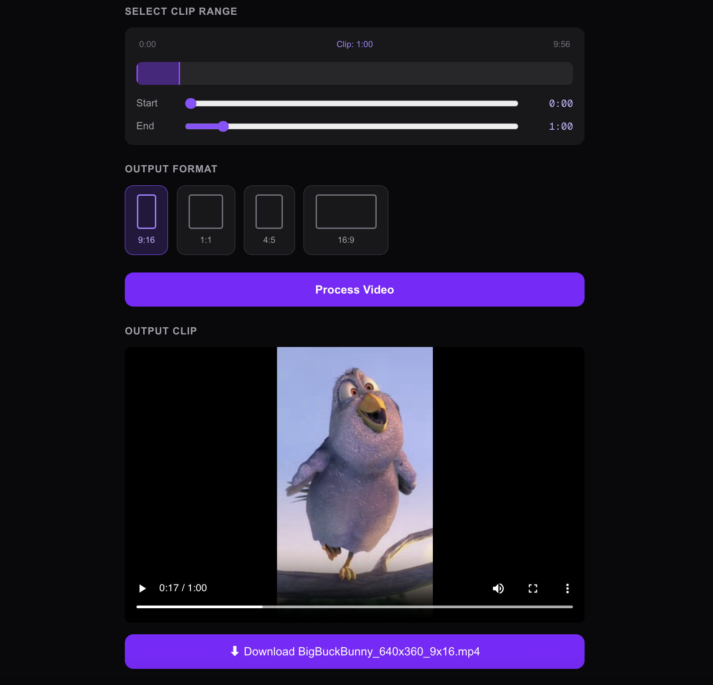

# Shorts Studio

A browser-based video editing tool for converting `long-form content` into `short-form clips` - trim, reframe, and export without leaving the browser.

Drop a file or paste a URL, pick your time range and aspect ratio, and download a production-ready clip in seconds.

---

### Key Features

- **Local File & URL Input** - Upload a video from disk or paste a remote URL to load it directly into the editor
- **Time Range Trimming** - Set precise start and end points to cut only the segment you need
- **Aspect Ratio Reframing** - Export to 9:16 (Shorts/Reels/TikTok), 16:9 (Landscape), 1:1 (Square), or 4:5 (Portrait Feed) with automatic crop calculations
- **Client-Side Processing** - Ensures complete data privacy by executing FFmpeg entirely within the browser using WebAssembly
- **Real-Time Progress Tracking** - Live progress bar during encoding so you always know where the job stands
- **Instant Download** - Output is delivered as a downloadable `.mp4` (H.264 + AAC) the moment processing completes

---

### Screenshots

 
 

 
 

 
 

